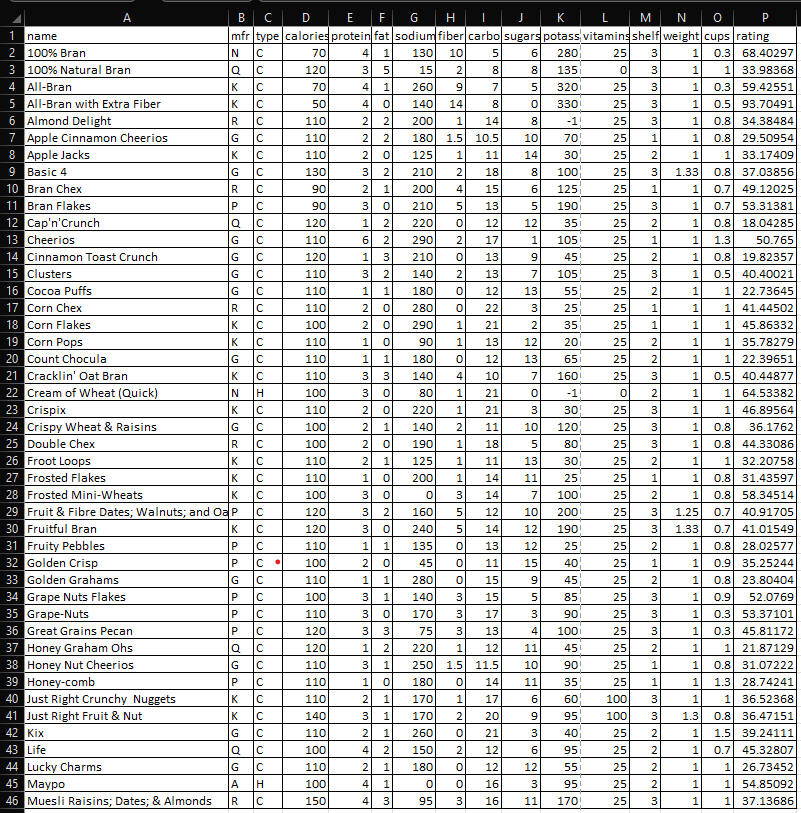
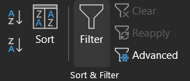
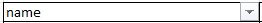
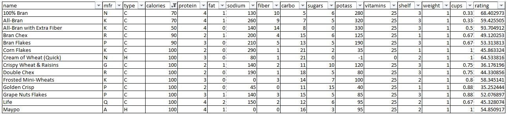

# Cora Wagner

## What:
The filter tool allows you to easily clean data within Excel. You can quickly remove excess data that does not work for your research, and focalize the data you want to continue looking at.

## Why:
Someone may choose to use the filter tool when they are working with very large data sets. When there are an abundance of data entries, it becomes time consuming to clean it. Using the filter tool makes it quick and easy to clean a large data set.

## How:
Here is the data that I started with. There were more cereal options, but for the purpose of this tutorial and the validity of screenshots, I reduced the cereal options. I have kept all data points the same.


You can find my reduced cereal data set [here](https://github.com/CoraWagner/Filter/blob/68e98fe8761e2745150774e25eca10c4593a7398/cereal.csv).

You can find the full cereal data set [here](https://www.kaggle.com/crawford/80-cereals/version/2).

### Filter Button
#### Step 1: Data -> Filter
To use the filter select a cell with data in it and click on the **Data** tab at the top of the Excel window.


Then find the **Sort & Filter** subsection and select the **Filter** button.



Once you have clicked the **Filter** button, dropdown arrows will appear beside each heading cell.



#### Step 2: Select Category and Set Filter
I decided that I want to filter the cereals based on the amount of calories present per serving. I selected all the options less than calories.


The resulting data set shows all of the cereals that are 100 calories or less per serving.


### Filter Equation
#### Step 1:
`=FILTER(A1:P46,J1:J46>=10,"")`


### Markdown

Markdown is a lightweight and easy-to-use syntax for styling your writing. It includes conventions for

```markdown
Syntax highlighted code block

# Header 1
## Header 2
### Header 3

- Bulleted
- List

1. Numbered
2. List

**Bold** and _Italic_ and `Code` text

```

For more details see [Basic writing and formatting syntax](https://docs.github.com/en/github/writing-on-github/getting-started-with-writing-and-formatting-on-github/basic-writing-and-formatting-syntax).
