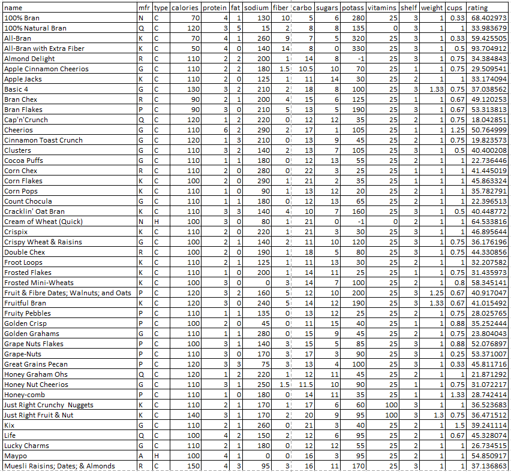

# Filter - Cora Wagner

## What:
The filter tool allows you to easily clean data within Excel. You can quickly remove excess data that does not work for your research, and focalize the data you want to continue looking at.

## Why:
Someone may choose to use the filter tool when they are working with very large data sets. When there are an abundance of data entries, it becomes time consuming to clean it. Using the filter tool makes it quick and easy to clean a large data set.

## How:
Here is the data that I started with. There were more cereal options, but for the purpose of this tutorial and the validity of screenshots, I reduced the cereal options. I have kept all data points the same.



[Microsoft Support - Filter](https://support.microsoft.com/en-us/office/filter-function-f4f7cb66-82eb-4767-8f7c-4877ad80c759)
[Kaggle Cereal Data Set](https://www.kaggle.com/crawford/80-cereals/version/2)

### Markdown

Markdown is a lightweight and easy-to-use syntax for styling your writing. It includes conventions for

```markdown
Syntax highlighted code block

# Header 1
## Header 2
### Header 3

- Bulleted
- List

1. Numbered
2. List

**Bold** and _Italic_ and `Code` text

```

For more details see [Basic writing and formatting syntax](https://docs.github.com/en/github/writing-on-github/getting-started-with-writing-and-formatting-on-github/basic-writing-and-formatting-syntax).

### Jekyll Themes

Your Pages site will use the layout and styles from the Jekyll theme you have selected in your [repository settings](https://github.com/CoraWagner/Filter/settings/pages). The name of this theme is saved in the Jekyll `_config.yml` configuration file.

### Support or Contact

Having trouble with Pages? Check out our [documentation](https://docs.github.com/categories/github-pages-basics/) or [contact support](https://support.github.com/contact) and we’ll help you sort it out.
