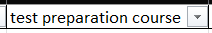
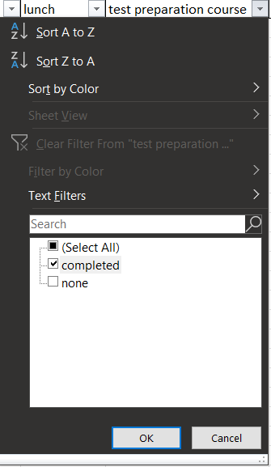
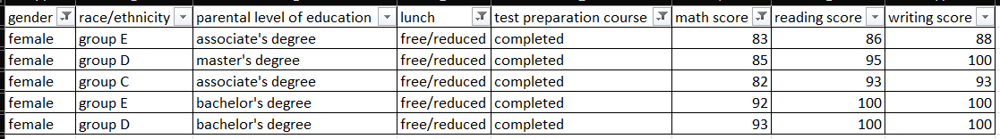
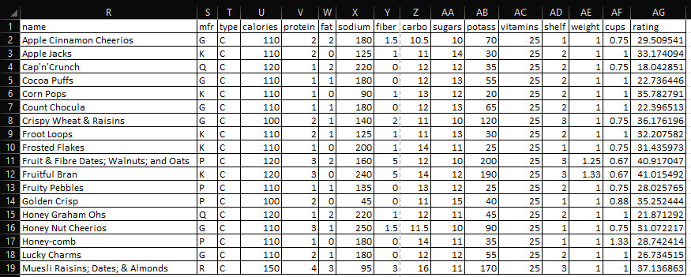
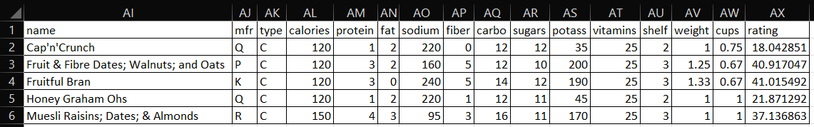

# Cora Wagner

## What:
The filter tool allows you to easily clean data within Excel. You can quickly remove excess data that does not work for your research and focalize the data you want to continue looking at.

## Why:
Someone may choose to use the filter tool when they are working with very large data sets. When there is an abundance of data entries, it becomes time consuming to clean it. Using the filter tool makes it quick and easy to clean a large data set.

## How:
### Filter Button
The first set of data shows the exam scores for students in varius studies showing the possible effect of home life and study habits. You can find a copy of the data set through [GitHub](https://github.com/CoraWagner/Filter/blob/15c1c21ab73d47d9e0e35ea4782ee3e8f8cea992/StudentsPerformance.csv)

#### Step 1: Data -> Filter
To use the filter, select a cell with data in it and click on the **Data** tab at the top of the Excel window.

Then find the **Sort & Filter** subsection and select the **Filter** button.

Once you have clicked the **Filter** button, dropdown arrows will appear beside each heading cell.

#### Step 2: Select Category and Set Filter
I decided that I want to filter the cereals based on the number of calories present per serving. I selected all the options less than calories.

The resulting data set shows all the cereals that are 100 calories or less per serving.

### Filter Equation
The next data set is a collection of cereals and the dietary statistics that pertain to a serving of each cereal. For the purpose of this tutorial, and the validity of screenshots, I reduced the cereal options. I have kept all data points the same. 

You can find my reduced data set through [GitHub](https://github.com/CoraWagner/Filter/blob/68e98fe8761e2745150774e25eca10c4593a7398/cereal.csv). 

#### Single Criteria:
Click on the cell you would like the new table to populate.

Type `=FILTER(A1:P46,J1:J46>=10,"")` into the Formula Bar.

This formula will return a table that has filtered out all data entries that contain less than 10 grams of sugar per serving.

#### Multiple Criteria:
Click on the cell you would like the new table to populate.

Type `=FILTER(A1:P46,(J1:J46>=10)*(D1:D46>110),"")` into the Formula Bar.

This formula will return a table that has filtered out all data entries that contain less than 10 grams of sugar **AND** have less than 110 calories per serving.

## Referenced Work
Exam scores data set on [Kaggle](https://www.kaggle.com/spscientist/students-performance-in-exams)

Cereal data set on [Kaggle](https://www.kaggle.com/crawford/80-cereals/version/2)

More informaion about the filter tool at [Microsoft Support](https://support.microsoft.com/en-us/office/filter-function-f4f7cb66-82eb-4767-8f7c-4877ad80c759)
