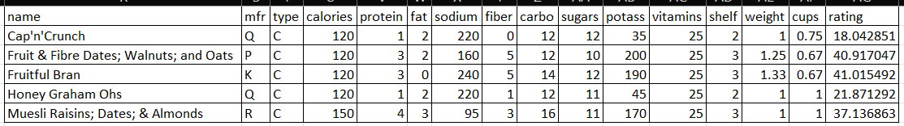

# Cora Wagner

## What:
The filter tool allows you to easily clean data within Excel. You can quickly remove excess data that does not work for your research and focalize the data you want to continue looking at.

## Why:
Someone may choose to use the filter tool when they are working with very large data sets. When there is an abundance of data entries, it becomes time consuming to clean it. Using the filter tool makes it quick and easy to clean a large data set.

## How:
### Filter Button
The first set of data shows the exam scores for students in various studies showing the possible effect of home life and study habits. You can find a copy of the data set through [GitHub](https://github.com/CoraWagner/Filter/blob/15c1c21ab73d47d9e0e35ea4782ee3e8f8cea992/StudentsPerformance.csv).

#### Step 1: Data -> Filter
To use the filter, select a cell with data in it and click on the **Data** tab at the top of the Excel window.

Then find the **Sort & Filter** subsection and select the **Filter** button.

Once you have clicked the **Filter** button, dropdown arrows will appear beside each heading cell.

#### Step 2: Select Category and Set Filter
Each dropdown menu will look like this. It will give you an option to select all, or the ability to select each individual item in the category. In my example image there are only two items to choose from.

For the filtered data set pictured below I chose to focus on female student who have free/reduced lunch, completed the study course, and had a math score of 80 or higher. By choosing the different filters I was able to focus on 5 entries out of the 1,000 original entries.

When using the dropdown menus, you can filter as little or as many categories as you would like. 

### Filter Equation
The next data set is a collection of cereals and the dietary statistics that pertain to a serving of each cereal. You can find a copy of the data set through [GitHub](https://github.com/CoraWagner/Filter/blob/64398241e4bf459fe211d29a0dfd6b7b0c8fe05b/cereal.csv). 

#### Single Criteria:
Click on the cell you would like the new table to populate in.

Type `=FILTER(A1:P46,J1:J46>=10,"")` into the Formula Bar.

This formula will return a table that has filtered out all data entries that contain 10 or less grams of sugar per serving.

#### Multiple Criteria:
Click on the cell you would like the new table to populate in.

Type `=FILTER(A1:P46,(J1:J46>=10)*(D1:D46>110),"")` into the Formula Bar.

This formula will return a table that has filtered out all data entries that contain 10 or less grams of sugar **AND** have 110 or less calories per serving.

## Referenced Work
Exam scores data set on [Kaggle](https://www.kaggle.com/spscientist/students-performance-in-exams)

Cereal data set on [Kaggle](https://www.kaggle.com/crawford/80-cereals/version/2)

More information about the filter tool at [Microsoft Support](https://support.microsoft.com/en-us/office/filter-function-f4f7cb66-82eb-4767-8f7c-4877ad80c759)

|Day|Topic|Due|
|1|[What is Data Science ](https://docs.google.com/document/d/1yhVB9DfddvJIiXitX2ZC1W0D3cJbcvib5fWmUlgqNO0/edit)||
|2|[VBA](https://docs.google.com/document/d/1ASoeI5CjFgyQTBm-HFPvmRC_94niTPx4s9crQEDVb10/edit)|[HW1 - Excel](https://docs.google.com/document/d/1g8eOYNe9sDmrstRgvFRZBskxjaIaD7Za4lFXSgPPkVw/edit)|
|3|[Data Communication](https://docs.google.com/document/d/1PTe_eezbRdZcxIOODyiQzDM4vtjVNJkVDC_7vZQSoZE/edit)||
|4|Work Day|[HW2 - VBA](https://docs.google.com/document/d/1bTkmUon_Kq6_DupNw2Szh-T4rFGqzeA2aIIBy7m1yhk/edit)|
|5|Why are data visualizations important ?|[Reading Due - Florence Nightengale](https://docs.google.com/forms/d/1FBgScIpV9Vpa-jb1nlWuoCqOxFE7v5SmQtacpFHpIq8/edit)|
|6|Tableau|[COVID Risk Calculator](https://www.nytimes.com/2021/12/30/style/covid-risk-calculator.html)|
|7|How visualizations lie|Reading Due - Differnet Kinds of Data Visualization|
|8|Work Day|HW 3 - Tableau|
|9|Danielle|Reading Due - How Charts Lie|
|10|R Intro||
|11|[Doing Better Data Visualization (R and ggplots tutorisl)](https://github.com/arielcwebster/DataScience/blob/main/Doing Better Data Visualization _ Enhanced Reader.pdf)|[Why Data is good for governments to provide](https://www.theguardian.com/local-government-network/2013/oct/21/open-data-us-san-francisco)|
|12|Work Day|HW 4 - ggplots|
|13|Sentiment Analysis - History and Types|Data Annonymity|
|14|TextBlob|[Reading Due - How to un annonymize data](https://www.theguardian.com/technology/2019/jul/23/anonymised-data-never-be-anonymous-enough-study-finds)|
|15|VADER|[De-Annonymizing Data](https://www.nature.com/articles/s41467-019-10933-3)|
|16|[P-Hacking Reflection](https://rss.onlinelibrary.wiley.com/doi/epdf/10.1111/1740-9713.01505)|HW 5 - Sentiment Analysis|
|Spring Break|||
||||
|17|Random Forest||
|18|||
|Advising Day|||
|19||HW 6 - Random Forest|
|20|Clustering - K Nearest Neighbors||
|21||[Possible Reading - Proxy Discrimination - When AI find predictive proxies for race - because society is segregated in this way. ](https://ilr.law.uiowa.edu/print/volume-105-issue-3/proxy-discrimination-in-the-age-of-artificial-intelligence-and-big-data)|
|22|||
|23||HW 6 - Clustering|
|24|Final Project||
|25|||
|26|||
|27|||
